# 🧠 Smart Resume Analyzer + Job Matcher

> An AI-powered web application that analyzes resumes against job descriptions using NLP and Machine Learning. Built with Flask, NLTK, scikit-learn, and a sleek dark-themed UI.


---

## ✨ Features

| Feature | Description |
|--------|-------------|
| 📄 Resume Parsing | Extract text from PDF and DOCX files |
| 🧠 NLP Processing | Tokenization, stopword removal, lemmatization |
| 🎯 Skill Extraction | Match 200+ skills across 7 categories |
| 📊 Match Scoring | TF-IDF + Cosine Similarity algorithm |
| ❌ Missing Skills | Identify gaps between your resume and the job |
| 🏆 Candidate Ranking | Upload multiple resumes and rank all candidates |
| 💡 Suggestions | Actionable tips to improve your resume |
| 🌐 Clean Dashboard | Modern, responsive dark-theme UI |

---

## 🖥️ Screenshots
## 📸 Project Preview

### Main Screens
<p align="center">
  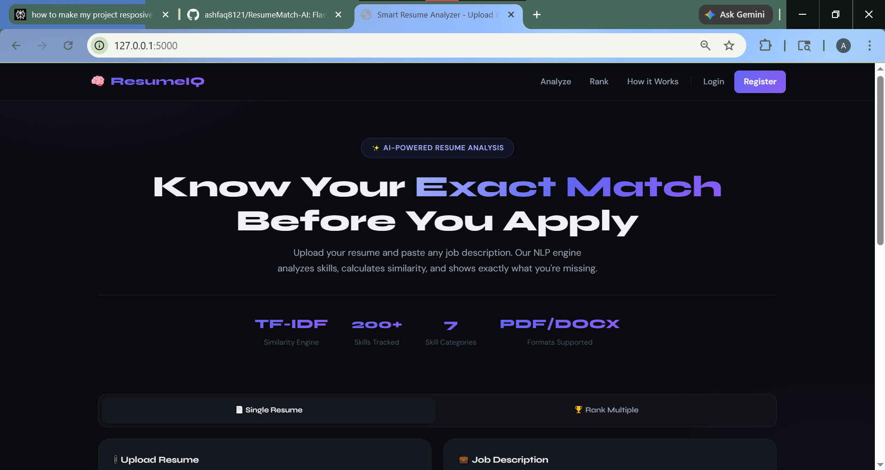
  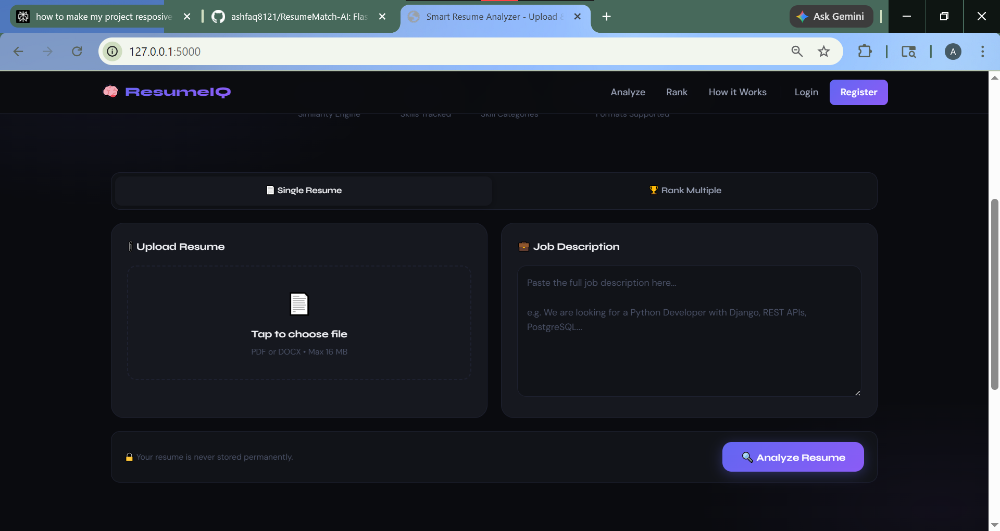
  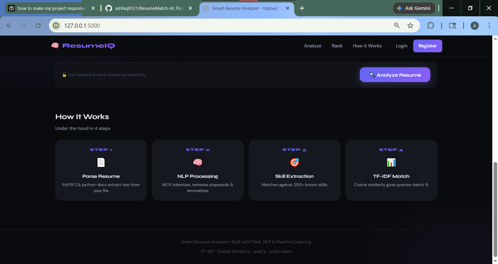
  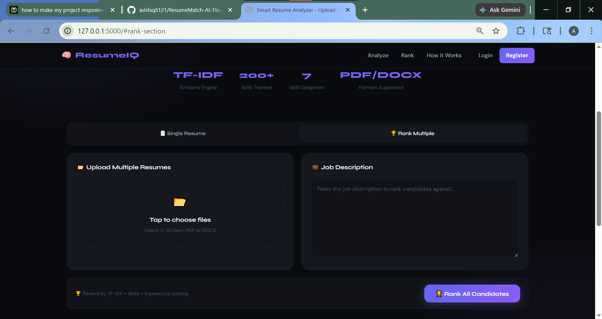
  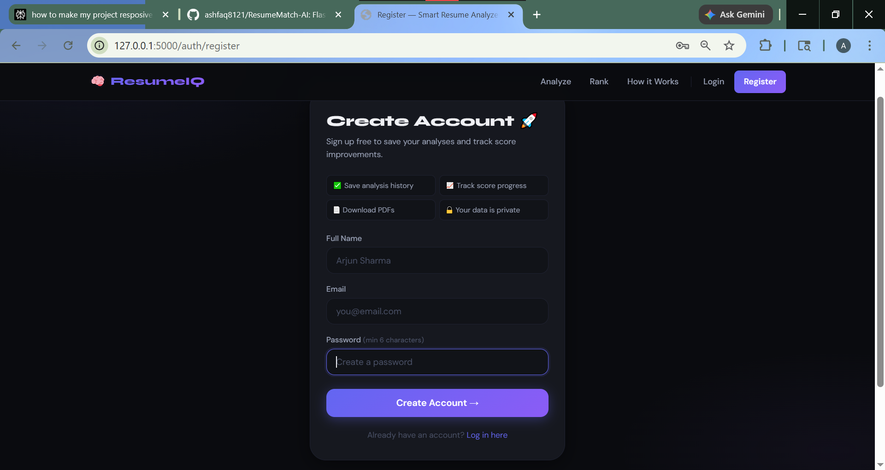
  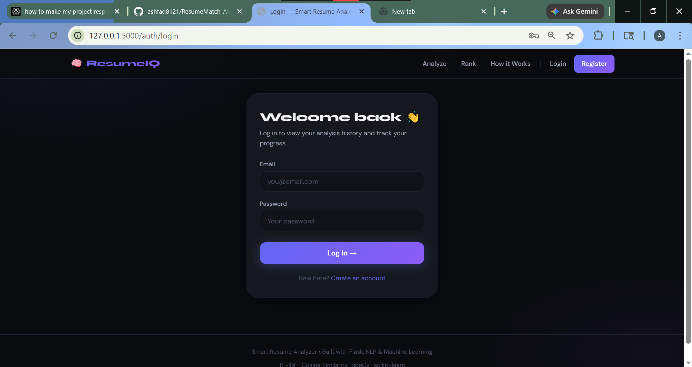
</p>

### History Page
<p align="center">
  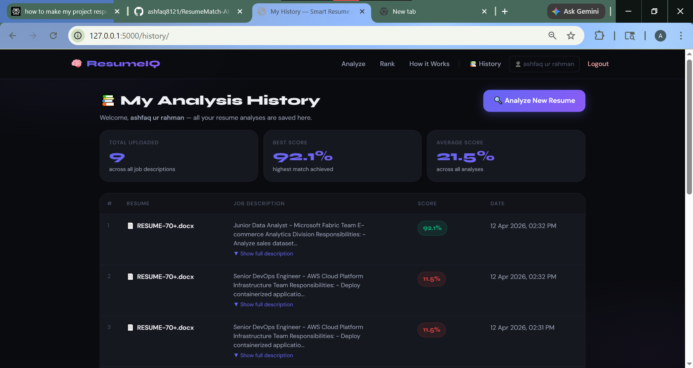
</p>

### Ranking Module
<p align="center">
  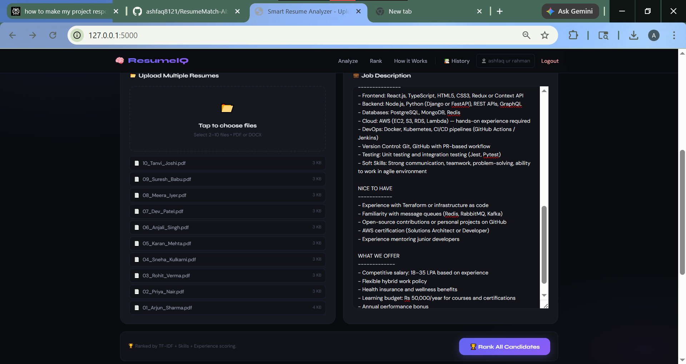
  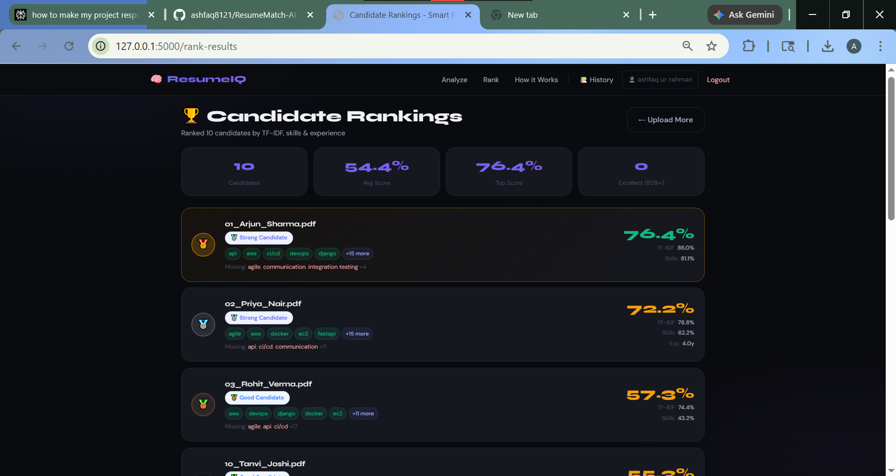
  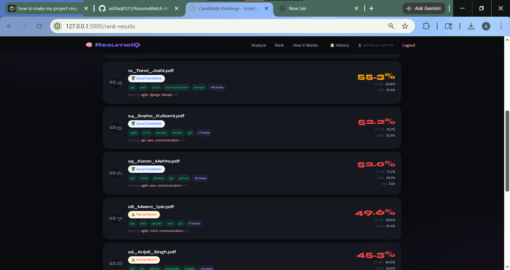
  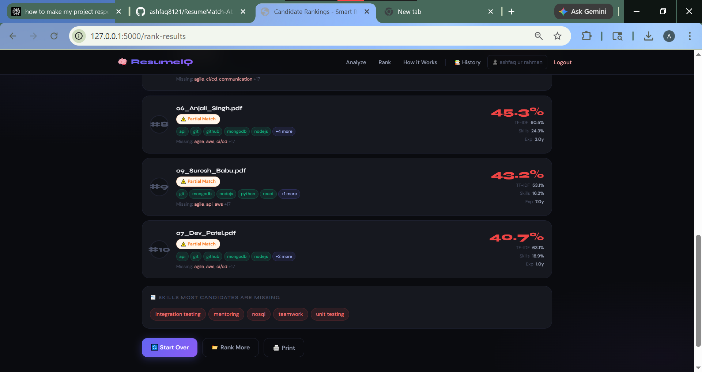
</p>

### Solo Resume Results
<p align="center">
  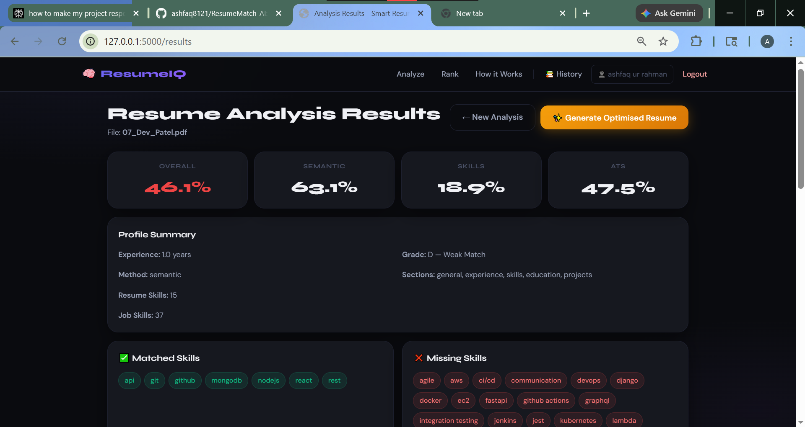
  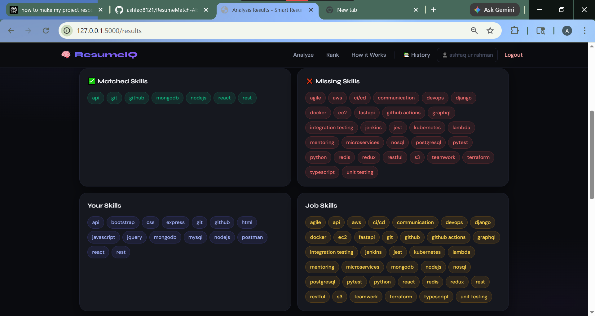
  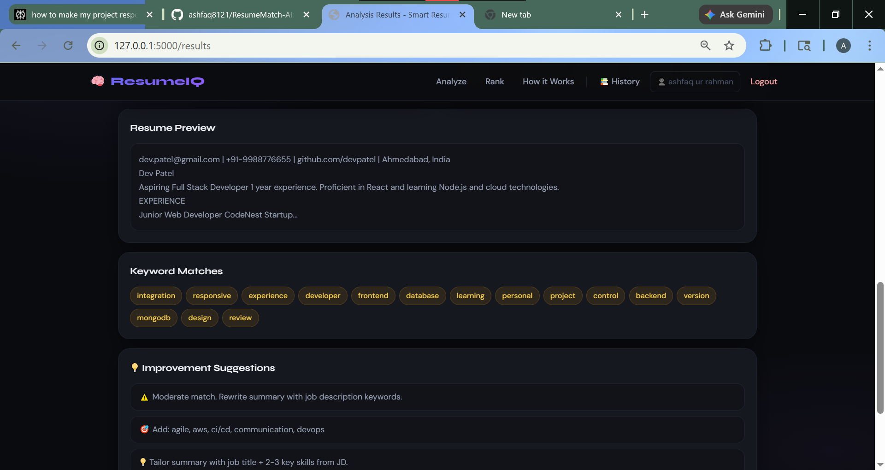
</p>

## 📄 Sample Resume
[View / Download AI Generated Resume](./images/ai-generated.pdf)


**Ranking Leaderboard**
- Medal rankings (🥇🥈🥉) for top candidates
- Composite score breakdown per candidate
- Pool-wide insights

---

## 🏗️ Project Architecture

```
sra main folder
|
updated-project folder
|
files
|
│
├── app/                         # Main application package
│   ├── __init__.py              # Flask app factory
│   ├── routes/
│   │   ├── __init__.py
│   │   └── main.py              # All URL routes / API endpoints
|   |   |_ auth.py
|   |   |_generator.py
|   |   |_history.py
|   |   |_main_updated_analyze_route.py
│   ├── services/
│   │   ├── parser.py            # PDF/DOCX text extraction
│   │   ├── nlp_processor.py     # NLTK tokenization, sectiondetection
|   |   |_ __init__.py
|   |   |_ parser.py
│   │   ├── skill_extractor.py   # Multi-word skill matching
│   │   ├── matcher.py           # TF-IDF + Cosine Similarity
│   │   └── ranker.py            # Multi-resume ranking logic
│   ├── utils/
|   |   |_ __init__.py
│   │   └── helpers.py           # Shared utility functions
│   └── models/                  # (Reserved for database models)
│
├── templates/                   # Jinja2 HTML templates
│   ├── base.html                # Shared layout, CSS, nav
│   ├── index.html               # Upload form page
│   ├── results.html             # Single resume analysis results
│   └── rank_results.html        # Multi-resume ranking dashboard
|   |_ generate_preview.html
|   |_ history.html
|   |_ results_button_snippet.html
│   | auth folder in templates
|   |-- in that file login.html
|   |-- 2nd file register.html    
|
├── static/
│   ├── css/                     # (CSS is embedded in templates)
│   ├── js/                      # (JS is embedded in templates)
│   └── uploads/                 # Temporary upload storage
│
├── data/
│   └── skills_db.json           # Master skills database (200+ skills)
│
├── tests/
│   ├── test_parser.py           # Unit tests for resume parser
│   └── test_matcher.py          # Unit tests for matcher, NLP, ranker
│
├── config.py                    # App configuration (dev/prod)
├── run.py                       # Entry point to start the server
├── requirements.txt             # Python dependencies
├── Procfile                     # Deployment: Render/Heroku start command
├── render.yaml                  # Render.com auto-deployment config
|── README.md                    # This file!
|
|__ images/

```

---

## ⚙️ Tech Stack

| Layer | Technology | Purpose |
|-------|-----------|---------|
| Backend | Flask 3.0 | Web framework, routing |
| PDF Parsing | PyPDF2 + pdfminer | Extract text from PDF |
| DOCX Parsing | python-docx | Extract text from Word files |
| NLP | NLTK | Tokenization, stopwords, lemmatization |
| ML | scikit-learn | TF-IDF vectorizer, Cosine Similarity |
| Numerics | NumPy | Array operations |
| Frontend | HTML5 + CSS3 + Vanilla JS | UI (no framework needed) |
| Fonts | Google Fonts (Syne + DM Sans) | Typography |
| Deployment | Render / Gunicorn | Production hosting |

---

## 🚀 Installation & Setup

### Step 1: Clone the Repository
```bash
git clone https://github.com/yourusername/smart-resume-analyzer.git
cd smart-resume-analyzer
```

### Step 2: Create a Virtual Environment (Recommended)

**Option A: Using Anaconda (Recommended for students)**
```bash
# Create a new conda environment
conda create -n resume-analyzer python=3.10
conda activate resume-analyzer
```

**Option B: Using Python venv**
```bash
python -m venv venv

# Activate on Windows:
venv\Scripts\activate

# Activate on Mac/Linux:
source venv/bin/activate
```

### Step 3: Install Dependencies
```bash
pip install -r requirements.txt
```

### Step 4: Download NLTK Data
```bash
python -c "import nltk; nltk.download('stopwords'); nltk.download('punkt'); nltk.download('averaged_perceptron_tagger'); nltk.download('wordnet')"
```

### Step 5: Run the Application
```bash
python run.py
```

Open your browser at: **http://127.0.0.1:5000**

---

## 🧪 Running Tests

```bash
# Run all tests
pytest tests/ -v

# Run with coverage report
pytest tests/ -v --cov=app

# Run a specific test file
pytest tests/test_matcher.py -v

# Run a specific test
pytest tests/test_matcher.py::TestJobMatcher::test_identical_texts_high_score -v
```

---

## 📡 API Endpoints

| Method | Endpoint | Description |
|--------|---------|-------------|
| `GET` | `/` | Home page (upload form) |
| `POST` | `/analyze` | Analyze single resume (form submission) |
| `POST` | `/rank` | Rank multiple resumes (form submission) |
| `GET` | `/results` | View last analysis results |
| `GET` | `/rank-results` | View last ranking results |
| `POST` | `/api/analyze` | JSON API: single resume analysis |
| `POST` | `/api/rank` | JSON API: multi-resume ranking |

---

## 🔬 How the Matching Algorithm Works

### 1. Text Extraction
The resume file (PDF/DOCX) is parsed using PyPDF2/pdfminer (PDF) or python-docx (DOCX). Raw text is cleaned to remove artifacts.

### 2. NLP Processing
NLTK processes the text:
- **Tokenization**: "Machine Learning Engineer" → `["machine", "learning", "engineer"]`
- **Stopword Removal**: Remove "the", "and", "is", "a"... (200+ words)
- **Lemmatization**: "running" → "run", "databases" → "database"

### 3. Skill Extraction
The cleaned text is scanned against 200+ known skills across 7 categories. Multi-word skills ("machine learning", "deep learning") are matched before single words to avoid false positives.

### 4. TF-IDF Vectorization
Both the resume and job description are converted to TF-IDF vectors:
- **TF (Term Frequency)**: How often a word appears in this document
- **IDF (Inverse Document Frequency)**: How rare/unique the word is
- Result: Rare, specific words (like "TensorFlow") score higher than common words

### 5. Cosine Similarity
The angle between the two TF-IDF vectors is measured. 
- **1.0** = identical documents
- **0.0** = completely different documents
- Converted to 0–100% for display

### 6. Final Score
```
Overall Score = (TF-IDF Score × 60%) + (Skills Match Score × 40%)
```

---

## ☁️ Deployment on Render.com

1. **Push to GitHub**:
   ```bash
   git init
   git add .
   git commit -m "Initial commit"
   git remote add origin https://github.com/yourusername/smart-resume-analyzer.git
   git push -u origin main
   ```

2. **Create Render Account** at [render.com](https://render.com)

3. **New Web Service** → Connect your GitHub repo

4. **Settings**:
   - **Build Command**: `pip install -r requirements.txt && python -m nltk.downloader stopwords punkt wordnet`
   - **Start Command**: `gunicorn run:app --bind 0.0.0.0:$PORT --workers 2`
   - **Environment**: Python 3

5. **Add Environment Variable**:
   - Key: `SECRET_KEY`
   - Value: (any long random string)

6. Click **Deploy** — your app will be live in ~5 minutes! 🎉

---

## 🔮 Future Improvements

- [ ] **spaCy Named Entity Recognition** for smarter section detection
- [ ] **Database storage** (PostgreSQL) to save analysis history
- [ ] **User accounts** with login/signup (Flask-Login)
- [ ] **Resume scoring over time** — track improvement
- [ ] **ATS simulation** — predict if resume passes Applicant Tracking Systems
- [ ] **Export to PDF** — download a formatted analysis report
- [ ] **Skill gap roadmap** — suggest learning paths for missing skills (link to Coursera/Udemy)
- [ ] **Industry-specific skills databases** (Data Science, Web Dev, DevOps, etc.)
- [ ] **Resume template suggestions** based on job role
- [ ] **Email reports** — send results to candidate's email

---

## 🤝 Contributing

1. Fork the repository
2. Create a feature branch: `git checkout -b feature/add-spacy`
3. Commit changes: `git commit -m "Add spaCy NER"`
4. Push: `git push origin feature/add-spacy`
5. Open a Pull Request

---

## 📝 License

MIT License — free to use, modify, and distribute.

---

## 👨‍💻 Author
MOHAMMAD ASHFAQ UR RAHMAN

Built as a placement-ready project demonstrating:
- Full-stack Python development (Flask)
- Natural Language Processing (NLTK)
- Machine Learning (TF-IDF, Cosine Similarity)
- Production-level code organization
- REST API design
- Frontend UI/UX (HTML/CSS)
